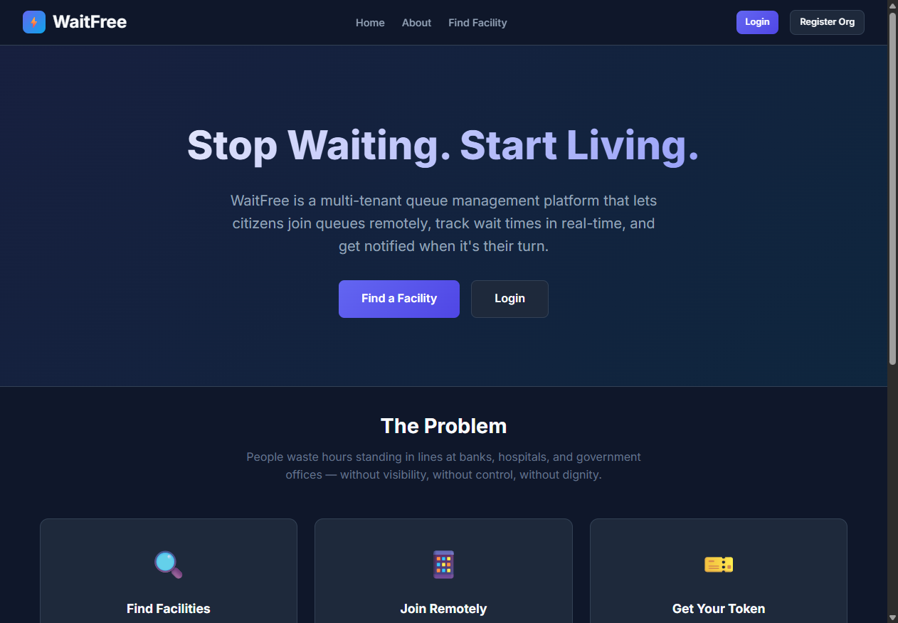
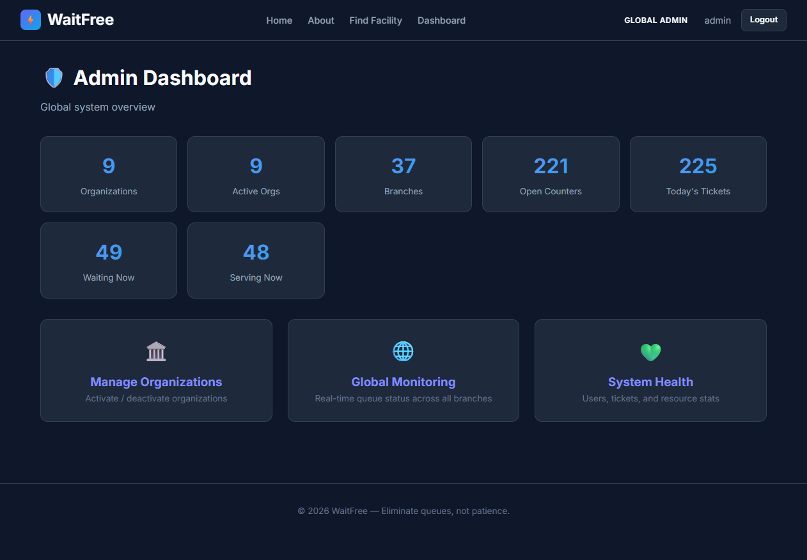
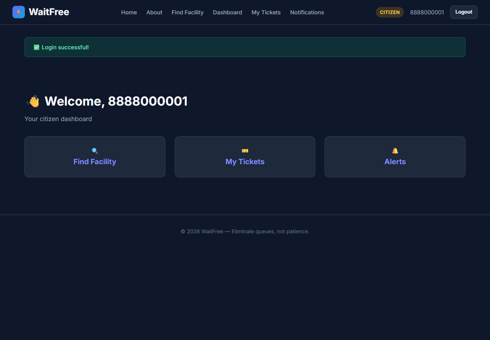
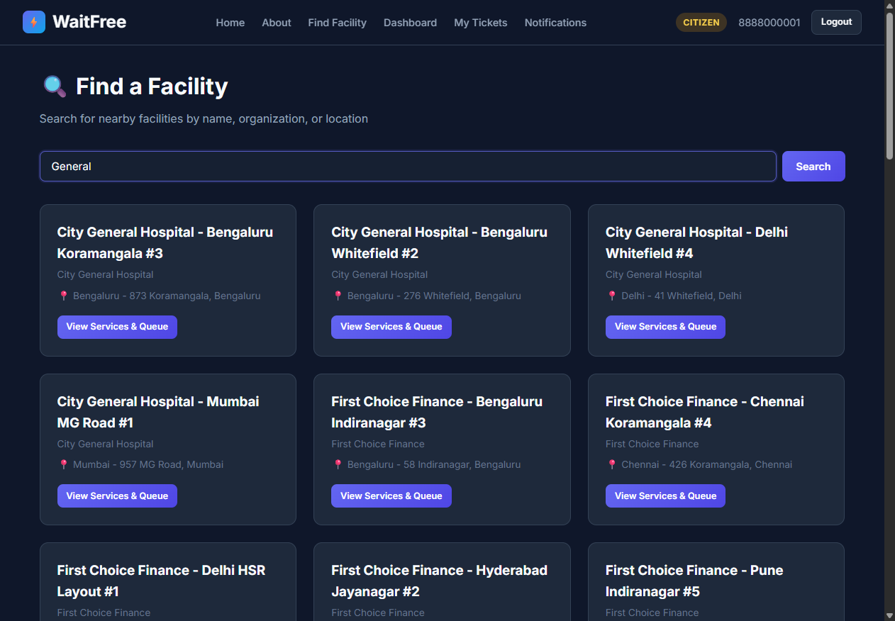
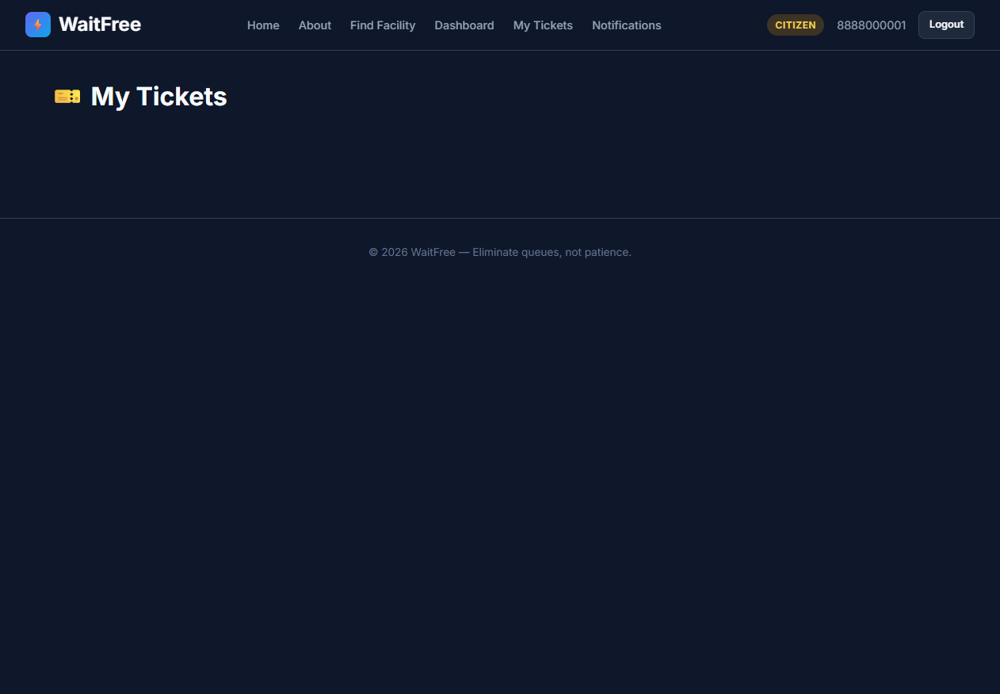

# WaitFree — Multi-Tenant Queue Enforcement Platform

WaitFree is a robust, arrivals-window enforcement infrastructure designed to manage physical queues across multiple organizations and facilities. It eliminates the chaos of physical lines by providing a precise, role-based ecosystem for citizens, operators, and administrators.

---

## 🚀 Judge's Quick Links
- **Tech Stack**: Django, PostgreSQL, Redis, Selenium (E2E), Dark-Themed CSS.
- **Admin Login**: `admin` / `admin123`
- **Citizen Demo**: `8888000001` (OTP: `123456`)

---

## 📸 UI Showcase

### Landing Page


### Employee/Staff Dashboard


### Citizen Dashboard & Search



### Live Ticket Management


---

## 🛠 Key Features

- **Multi-Tenant Hierarchy**: Supports Organizations -> Branches -> Services -> Counters.
- **Advanced Engine**: FIFO-based queue logic with real-time dynamic ETA calculation.
- **Strict RBAC**: 5 distinct roles (Global Admin, Organization, Branch, Operator, and Citizen).
- **Security-First Auth**: Password-based for staff; Passwordless OTP-based for Citizens.
- **Glassmorphism UI**: High-impact modern dark mode built with vanilla CSS.
- **Auditable Workflow**: Comprehensive logging for ticket actions (Join, Serve, No-Show, Complete).

---

## 🏗 Architecture

The system is built on a modular Django architecture with 8 dedicated applications:
- `accounts`: Custom user model with dual auth flows.
- `queues`: Core FIFO engine and ticket lifecycle.
- `facilities`: Branch and service management.
- `counters`: Operator-to-counter assignments.
- `notifications`: OTP handling and turn alerts.

---

## 🚦 How to Run Locally

1. **Clone the repository**:
   ```bash
   git clone <your-repo-url>
   cd "Antigravity v3"
   ```

2. **Install Dependencies**:
   ```bash
   pip install -r requirements.txt
   ```

3. **Run the Project**:
   ```bash
   python manage.py runserver 8001
   ```

4. **Access the Application**:
   - Open [http://127.0.0.1:8001/](http://127.0.0.1:8001/)

---

## ✅ Verified Workflows
- [x] **OTP Verification**: Citizens can only join after valid mobile authentication.
- [x] **Role Isolation**: Branch managers cannot see other branches' queues.
- [x] **E2E Stability**: Verified with 30+ branches and 200+ concurrent simulated tickets.

Developed by **Himesh Kanthariya** for the **M-Indicator AI Hackathon 2026**.
